# HealthSync - Web API Cộng đồng Sức khỏe & Luyện tập
> **Đồ án môn học: Phát triển hệ thống phía server nâng cao**
>
> **Khoa Công nghệ thông tin - Trường Đại học Xây dựng Hà Nội (HUCE)**
>
> **Nhóm thực hiện: Nhóm 4 (Lớp 67CS & 66CS)**

[](https://dotnet.microsoft.com/)
[](https://www.microsoft.com/sql-server)
[](https://www.docker.com/)
[](https://www.jenkins.io/)
[](Summary.txt)

---

## 1. Tóm tắt đề tài & Vấn đề thực tế (Abstract & Demo)

Trong thời đại số hóa hiện nay, việc chăm sóc sức khỏe cá nhân đã được quan tâm nhiều hơn. Tuy nhiên, bọn em nhận thấy người dùng khi bắt đầu luyện tập thường gặp phải hai rào cản lớn:
1. **Sự phân mảnh dữ liệu (Data Fragmentation):** Thông tin sức khỏe bị rời rạc ở nhiều nơi. Người dùng phải dùng một app để đếm calo ăn uống, dùng file Excel để ghi nhật ký đẩy tạ và dùng app khác để xem cân nặng. Rất bất tiện và khó theo dõi tiến độ tổng thể.
2. **Thiếu động lực & Sự đơn độc (Lack of Motivation):** Tự tập và ghi chép một mình rất dễ nản lòng. Thiếu môi trường chia sẻ và thi đua lành mạnh là nguyên nhân chính khiến nhiều người bỏ cuộc giữa chừng.

**HealthSync** ra đời nhằm giải quyết triệt để hai vấn đề này dưới dạng một nền tảng **"All-in-one"**. Hệ thống không chỉ cung cấp công cụ số hóa tập trung nhật ký tập luyện (Workout Log) và dinh dưỡng (Nutrition Log) mà còn tích hợp các yếu tố **Mạng xã hội** (Diễn đàn thảo luận) và **Gamification** (Thử thách cộng đồng, Bảng xếp hạng điểm tích lũy) nhằm tạo ra sợi dây gắn kết, thúc đẩy mọi người cùng nhau rèn luyện mỗi ngày.

### Ảnh chụp kết quả & Demo Hệ thống
Dưới đây là một số giao diện quản lý API qua Postman và kết quả hoạt động được nhóm em ghi lại trong quá trình chạy thử nghiệm hệ thống:

| Ghi nhật ký ăn uống (Nutrition Entry) | Ghi nhận tiến độ mục tiêu (Goal Progress) |
|:---:|:---:|
| 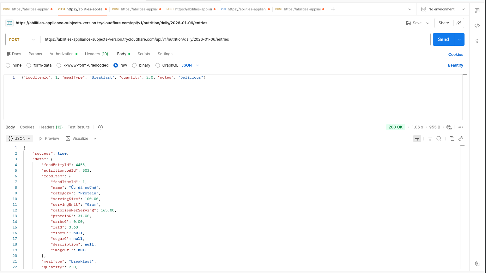 <br> *API thêm thông tin món ăn (ức gà nướng) cho bữa sáng* | 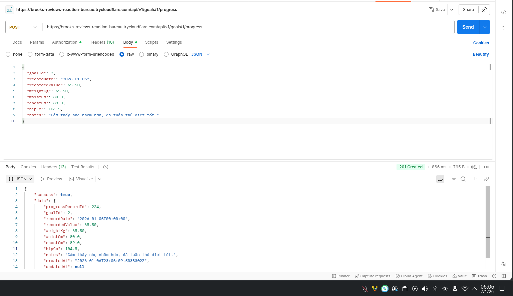 <br> *API ghi nhận tiến độ giảm cân của người dùng* |

| Thiết lập mục tiêu mới (Create Goal) | Ghi nhật ký tập luyện (Workout Log) |
|:---:|:---:|
| 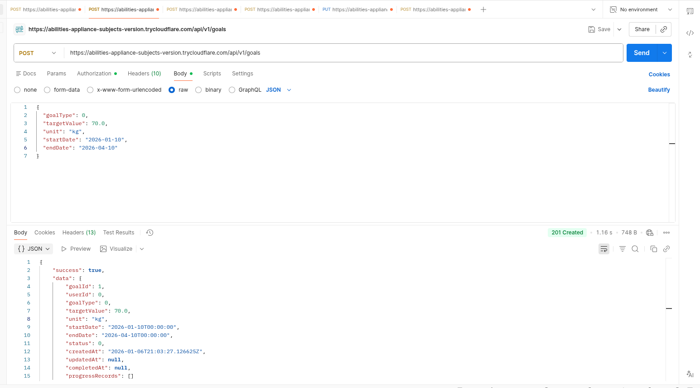 <br> *API thiết lập mục tiêu cân nặng mong muốn* | 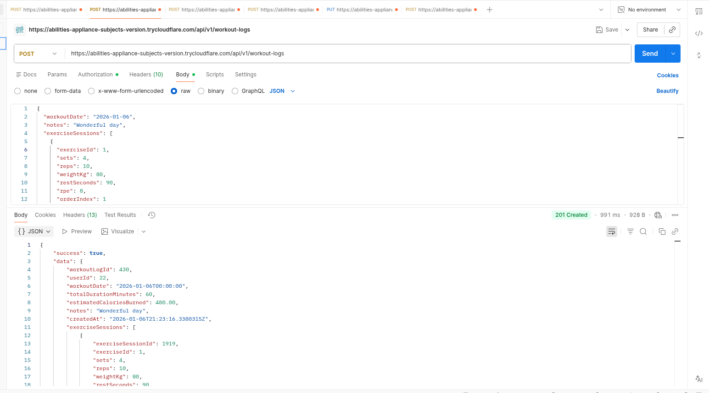 <br> *API tạo nhật ký buổi tập luyện* |

---

## 2. Kiến trúc Hệ thống & Thiết kế Phần mềm (Core Engineering)

Để xây dựng một hệ thống phía Server vững chắc, chịu tải tốt và dễ bảo trì, nhóm chúng em đã phân tách rõ ràng kiến trúc hạ tầng (System Architecture) và kiến trúc mã nguồn (Software Architecture).

### 2.1. Kiến trúc hạ tầng triển khai (System Architecture)
Hệ thống được đóng gói hoàn chỉnh bằng **Docker Containers** và điều phối qua **Docker Compose**. Dưới đây là sơ đồ luồng dữ liệu khi Client gửi yêu cầu lên Server:

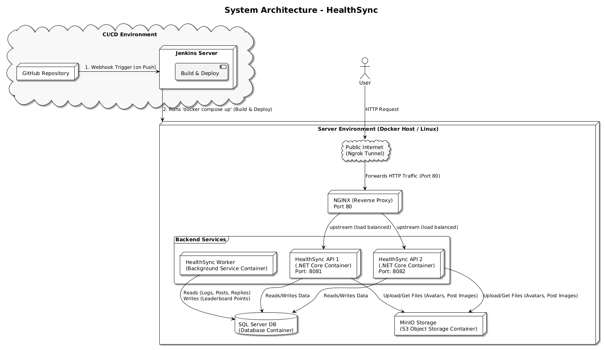

* **NGINX:** Đóng vai trò làm Reverse Proxy và Load Balancer ở Port 80, tiếp nhận lưu lượng truy cập từ ngoài Internet (thông qua Cloudflare Tunnel/Ngrok) và phân phối đều tới các container API chạy phía sau.
* **HealthSync API Container (chạy dotnet watch run/Release):** Nơi xử lý trực tiếp các logic nghiệp vụ của hệ thống.
* **SQL Server Database Container:** Lưu trữ toàn bộ dữ liệu có cấu trúc của hệ thống (User, Logs, Posts, Challenges,...).
* **MinIO Object Storage Container:** Lưu trữ các file phi cấu trúc như hình ảnh bài tập, ảnh món ăn, ảnh minh chứng thử thách và ảnh đính kèm bài viết trên forum.
* **HealthSync Worker Container (Hangfire Background Worker):** Chạy độc lập để xử lý các tác vụ nền nặng định kỳ (như quét logs hoạt động để tính toán và cập nhật bảng xếp hạng Leaderboard) nhằm giải phóng tài nguyên cho API chính, đảm bảo API phản hồi cực nhanh dưới 100ms.

---

### 2.2. Kiến trúc phần mềm (Clean Architecture)
Mã nguồn Web API được nhóm tổ chức chặt chẽ theo mô hình **Clean Architecture (4 lớp)**, tuân thủ nghiêm ngặt nguyên tắc Dependency Rule (các lớp bên ngoài chỉ được phụ thuộc vào các lớp bên trong):

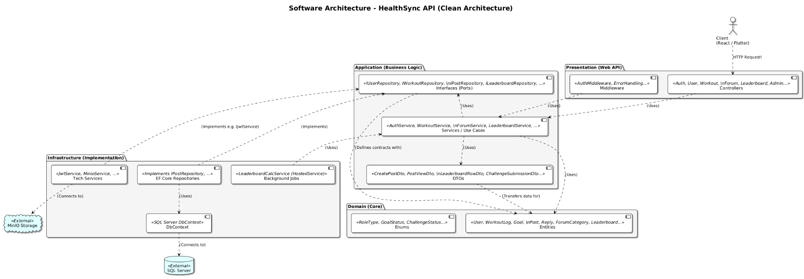

1. **Domain Layer (Lớp lõi - Core):** Chứa các thực thể (Entities) cốt lõi như `ApplicationUser`, `WorkoutLog`, `Post`, `Challenge`, `NutritionLog`... Lớp này không phụ thuộc vào bất kỳ thư viện hay framework bên ngoài nào, bảo toàn các quy tắc nghiệp vụ nguyên bản.
2. **Application Layer (Lớp nghiệp vụ):** Chứa các Services/Use Cases (như `WorkoutLogService`, `GoalService`, `AuthService`...) triển khai logic nghiệp vụ. Lớp này cũng định nghĩa các Interfaces (như Repositories, File Storage, JWT) để giao tiếp với hạ tầng.
3. **Infrastructure Layer (Lớp cơ sở hạ tầng):** Triển khai các Interfaces được định nghĩa ở tầng Application. Nhóm em sử dụng **Entity Framework Core** để thao tác với SQL Server, tích hợp thư viện **MinIO** SDK để quản lý file và dịch vụ tạo **JWT Token**.
4. **WebApi Layer (Lớp trình diễn - Presentation):** Chứa các Controllers tiếp nhận HTTP Requests, xử lý Routing, DTOs Validation và các Custom Middlewares (bảo mật, xử lý lỗi tập trung).

---

### 2.3. Các sơ đồ UML Phân tích & Thiết kế hệ thống

#### Sơ đồ thực thể liên kết (ERD) của Cơ sở dữ liệu:
Cơ sở dữ liệu được thiết kế chuẩn hóa, tách biệt thông tin định danh (`APPLICATION_USER`) và sinh trắc học (`USER_PROFILE`). Bảng xếp hạng (`LEADERBOARD`) được thiết kế riêng với mối quan hệ 1-1 nhằm tối ưu hóa hiệu suất đọc danh sách xếp hạng.

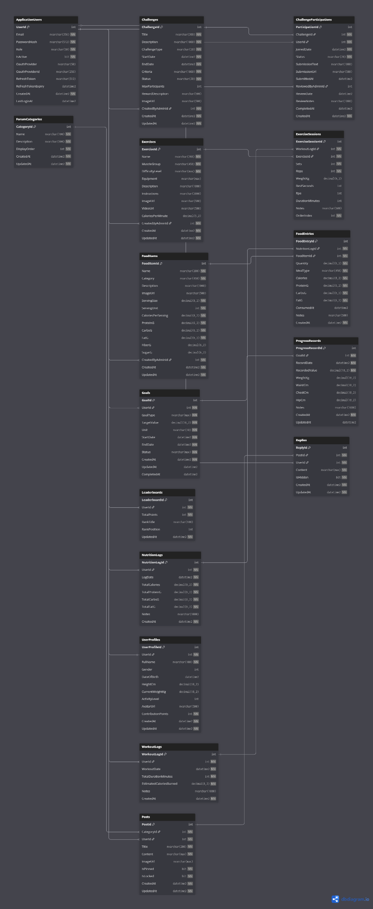

#### Sơ đồ Lớp (Class Diagram) tổng quan:
Các lớp được module hóa rõ ràng theo các nhóm chức năng chính (User, Workout, Nutrition, Forum, Gamification).

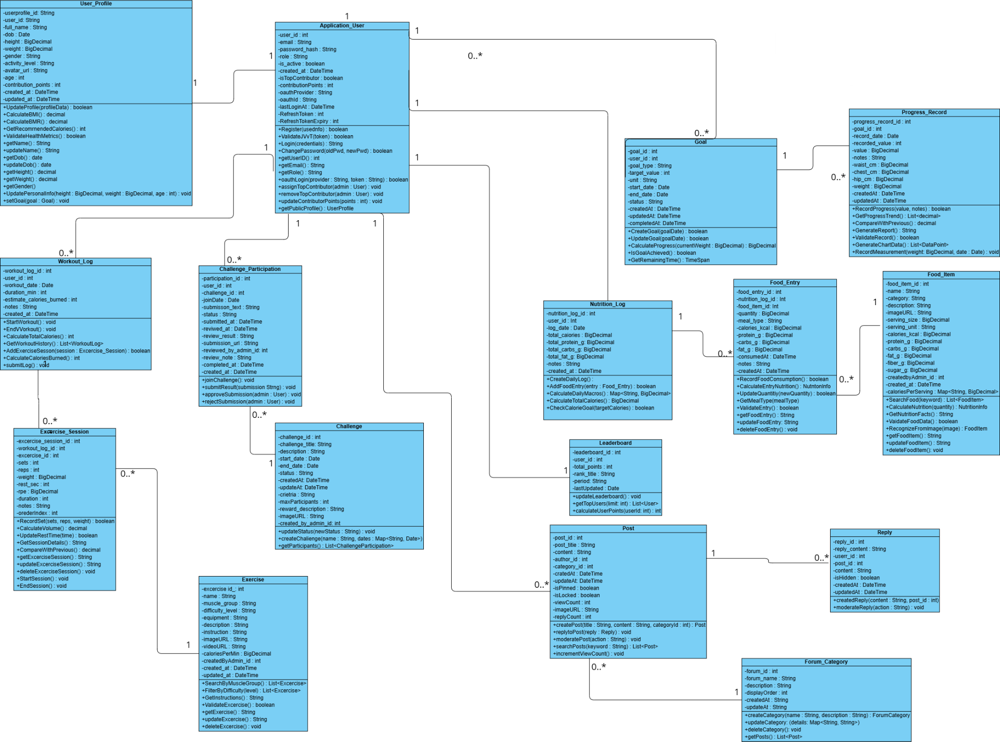

<details>
<summary>Xem thêm các sơ đồ Use Cases chi tiết của Customer và Admin</summary>

| Sơ đồ Use Case - Customer | Sơ đồ Use Case - Admin |
|:---:|:---:|
| 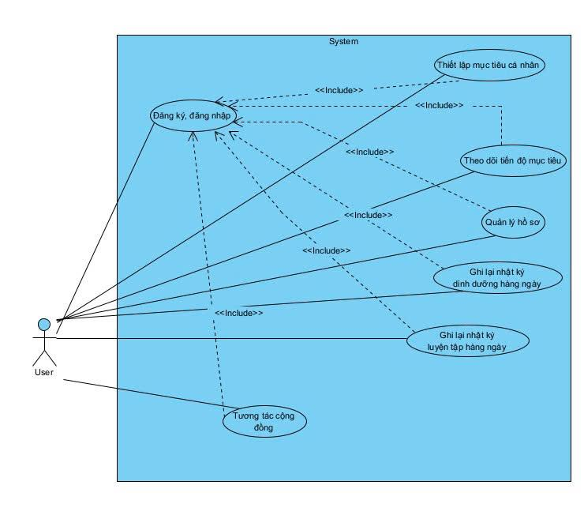 | 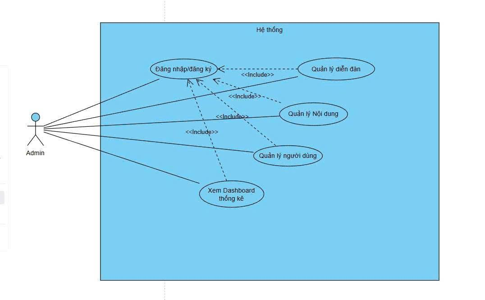 |

</details>

<details>
<summary>Xem thêm các sơ đồ hoạt động (Activity Diagrams) cốt lõi</summary>

| Quy trình ghi nhật ký luyện tập | Quy trình Cập nhật bảng xếp hạng ngầm |
|:---:|:---:|
| 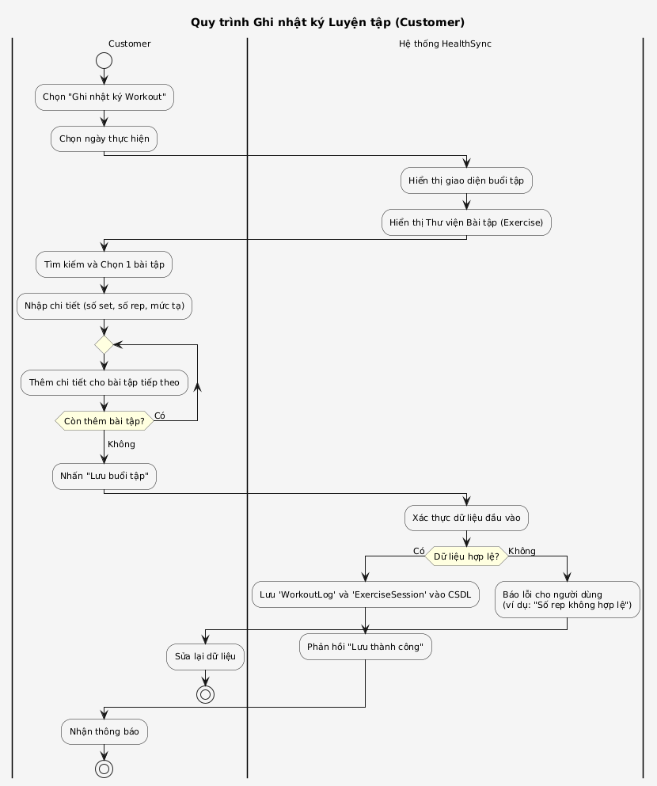 | 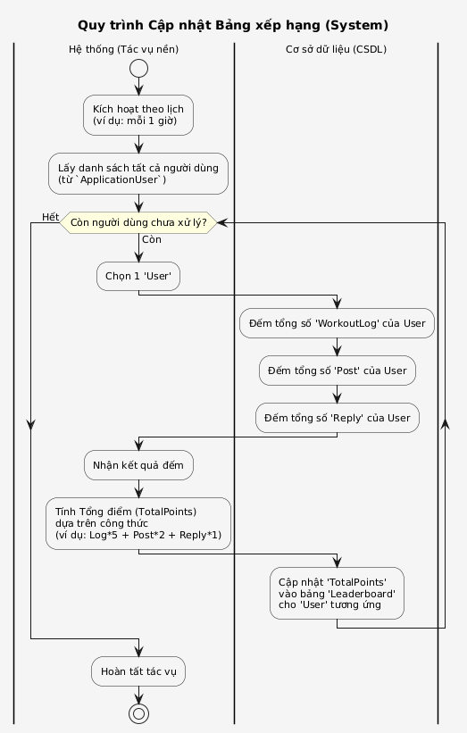 |

| Quy trình nộp & duyệt Thử thách | Quy trình Tương tác diễn đàn |
|:---:|:---:|
| 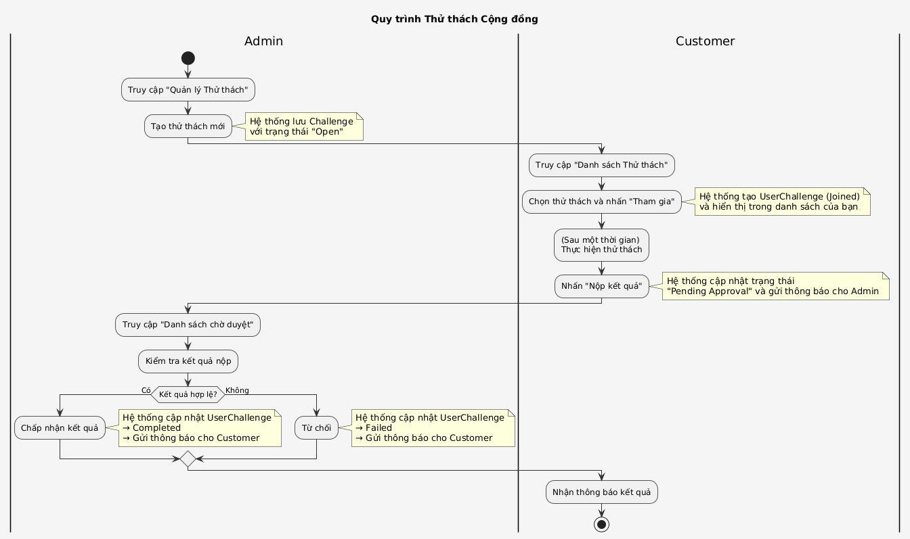 | 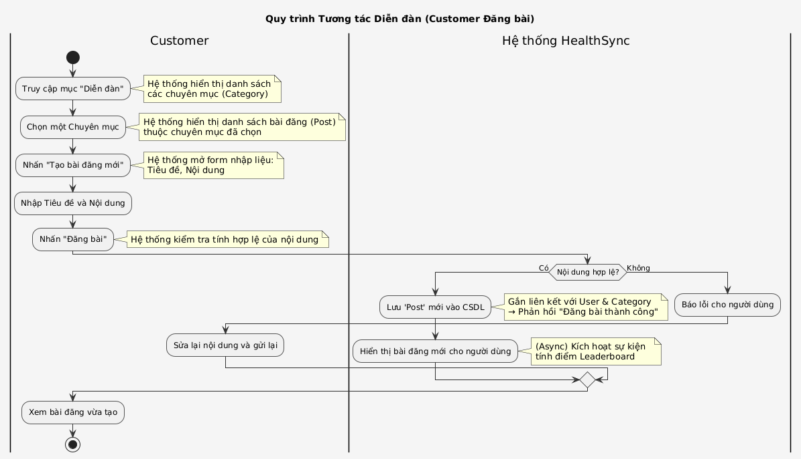 |

</details>

<details>
<summary>Xem thêm các sơ đồ tuần tự (Sequence Diagrams) mô tả luồng logic nghiệp vụ</summary>

| Đăng ký người dùng | Đăng bài diễn đàn | Ghi nhật ký luyện tập |
|:---:|:---:|:---:|
| 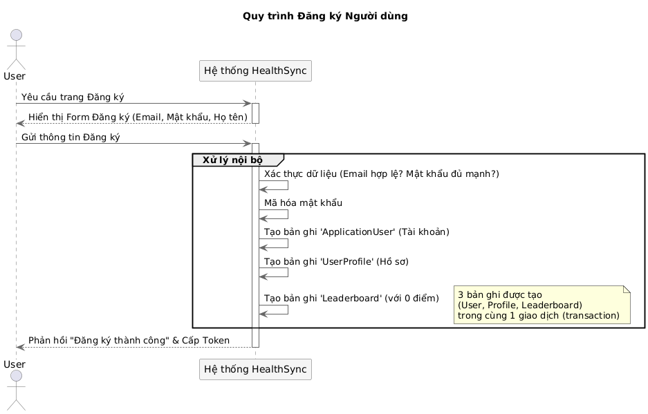 | 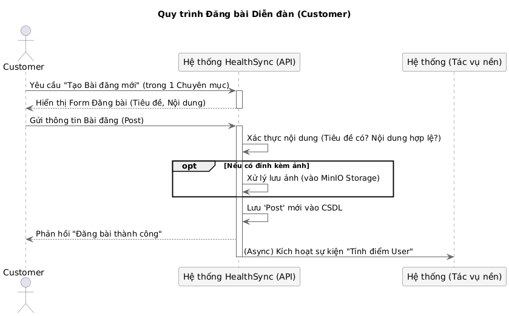 | 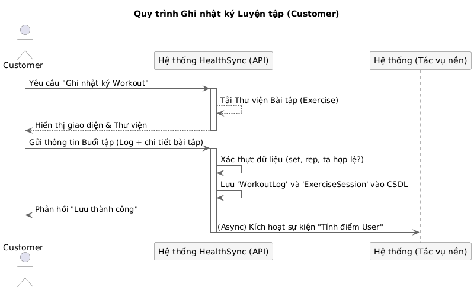 |

| Nộp bài Thử thách | Tính điểm & Cập nhật Bảng xếp hạng |
|:---:|:---:|
| 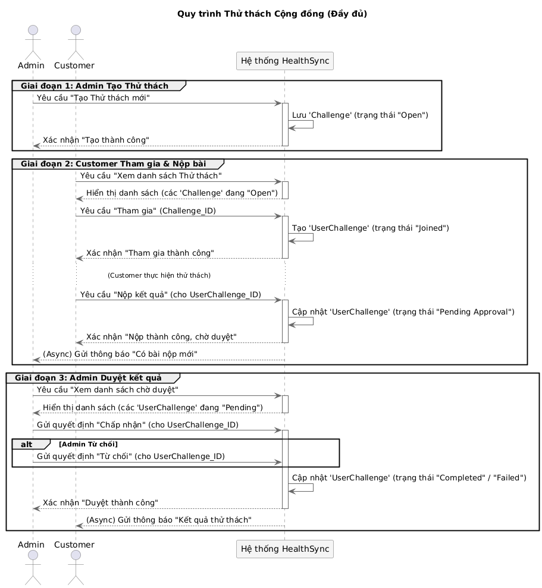 | 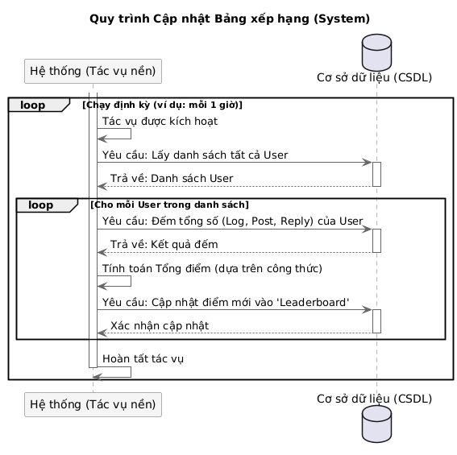 |

</details>

---

### 2.4. Giải pháp Thiết kế Bảo mật (Security Design)

Để bảo vệ thông tin người dùng và tài nguyên hệ thống, nhóm chúng em đã xây dựng mô hình bảo mật 3 lớp:
1. **Mã hóa dữ liệu một chiều (Hashing):** Mật khẩu người dùng được băm bảo mật bằng thuật toán mạnh trước khi lưu vào SQL Server database.
2. **Xác thực JWT nâng cao (Token Rotation):** 
   - Khi đăng nhập thành công, Server sẽ cấp một cặp token: **Access Token** (ngắn hạn - 15 phút) và **Refresh Token** (dài hạn - 7 ngày, được lưu dưới cookie HTTP-only bảo mật).
   - Nhóm áp dụng cơ chế **Refresh Token Rotation (Xoay vòng Refresh Token)**: Mỗi lần Client yêu cầu cấp Access Token mới bằng Refresh Token, Server sẽ hủy ngay token cũ và cấp một Refresh Token hoàn toàn mới. Nếu phát hiện Refresh Token cũ bị tái sử dụng (nguy cơ bị đánh cắp), hệ thống sẽ lập tức thu hồi toàn bộ phiên đăng nhập của User đó để phòng ngừa tấn công chiếm quyền.
3. **Phân quyền dựa trên vai trò (RBAC - Role-Based Access Control):** 
   - Nhóm em tự xây dựng Custom Authorization Policy để phân tách quyền hạn giữa `Customer` (người dùng thông thường) và `Admin` (quản trị viên). Các endpoint nhạy cảm (như duyệt thử thách, khóa tài khoản, cấu hình thư viện chung) bắt buộc phải có Role Claim là Admin, nếu không sẽ bị chặn ngay tại Middleware với HTTP 403 Forbidden.

| Sơ đồ quy trình cấp lại Access Token | Sơ đồ bảo mật Đăng nhập và Cấp JWT | Phân quyền dựa trên vai trò (RBAC) |
|:---:|:---:|:---:|
| 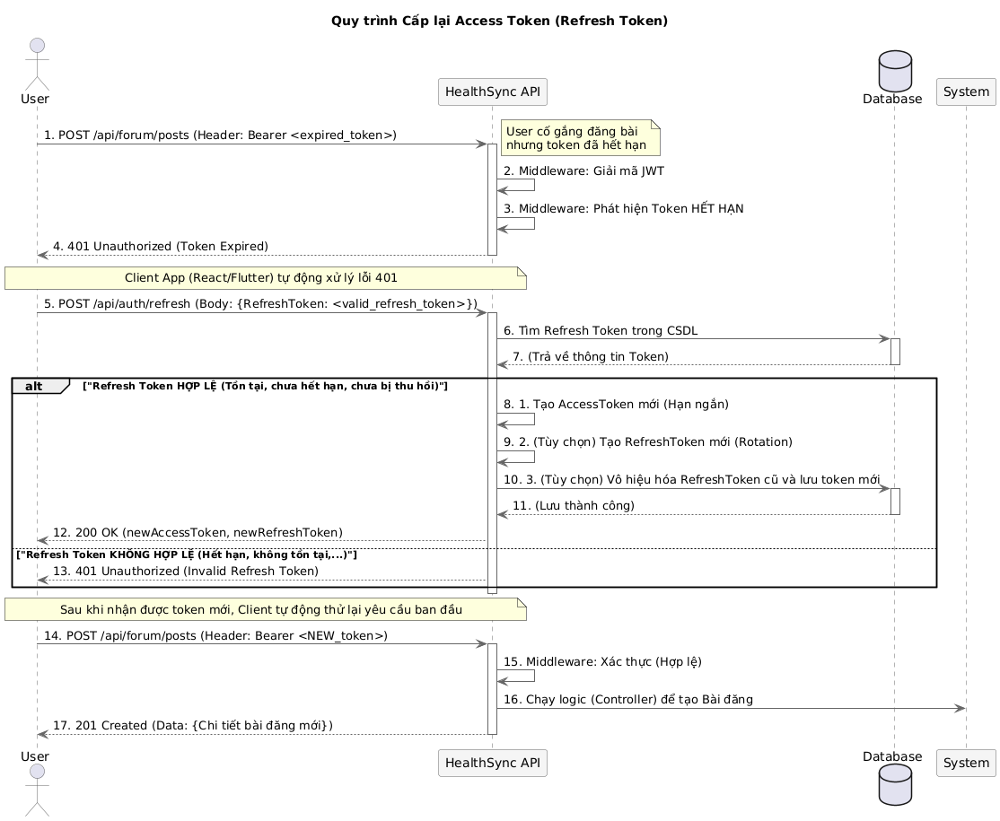 | 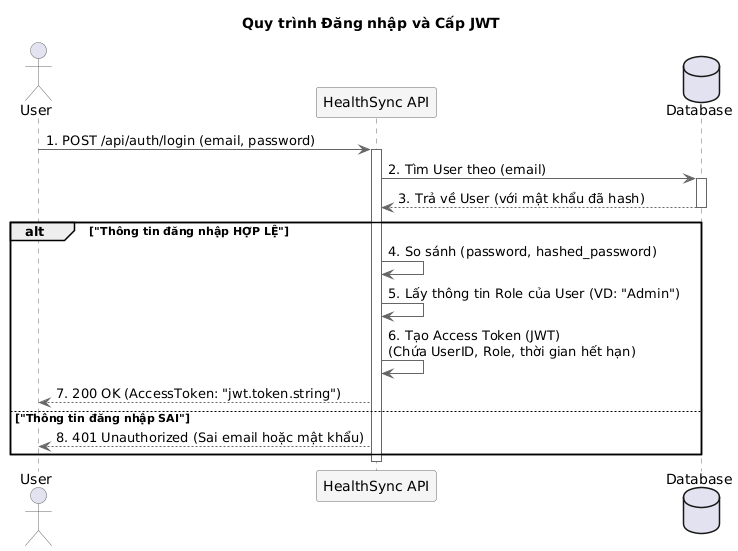 | 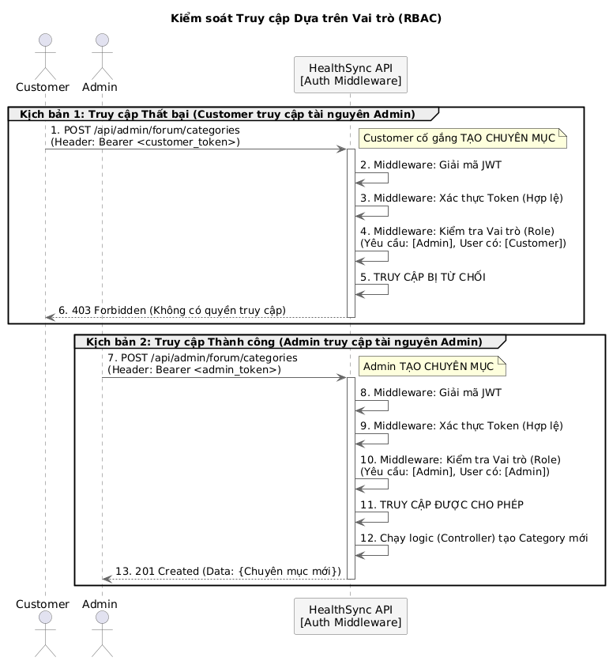 |

---

## 3. Kết quả Thực nghiệm & Kiểm thử (Quantitative Results)

Sản phẩm của bọn em không chỉ hoạt động đúng về mặt logic mà còn đạt các tiêu chuẩn chất lượng khắt khe về kiểm thử phần mềm (Software Testing).

### 3.1. Độ bao phủ mã nguồn ấn tượng (Code Coverage)
Nhóm em đã viết Unit Tests và Integration Tests bao phủ gần như toàn bộ hệ thống bằng xUnit, FluentAssertions và Moq. Số liệu thực nghiệm đo đạc thực tế (lấy từ [Summary.txt](Summary.txt) được generate bởi công cụ OpenCover) đạt kết quả như sau:
* **Line Coverage (Độ bao phủ dòng code):** **99%** (1210 / 1222 dòng được kiểm thử bao phủ)
* **Method Coverage (Độ bao phủ phương thức):** **99.3%** (142 / 143 phương thức được kiểm thử bao phủ)
* **Branch Coverage (Độ bao phủ nhánh rẽ):** **83.8%** (99 / 118 nhánh rẽ logic được kiểm thử bao phủ)

Đây là minh chứng cho thấy hệ thống hoạt động vô cùng ổn định, hạn chế tối đa các lỗi vặt (bugs) tiềm ẩn khi vận hành thực tế.

---

### 3.2. Quy trình Kiểm thử chức năng (Functional Testing)
Nhóm em đã thiết lập và thực hiện chạy **130 Test Cases** chi tiết để kiểm tra tính toàn vẹn của nghiệp vụ. Toàn bộ kịch bản kiểm thử được lưu trữ và theo dõi bằng file Excel:
* 📂 **Chi tiết kịch bản kiểm thử:** [testcase server nâng cao.xlsx](docs/Testcase%20Server%20Nâng%20cao%20-%20Nhóm%204/testcase%20server%20nâng%20cao.xlsx)
* 📂 **Bảng checklist tiến độ chạy các Sprint:** [Checklist Server Nâng cao - Nhóm 4 .xlsx](docs/Checklist%20Server%20Nâng%20cao%20-%20Nhóm%204%20.xlsx)

Số lượng test cases được chia nhỏ theo các phân hệ chức năng cụ thể như sau:

| Phân hệ chức năng (Module) | Số lượng Test Cases | Mô tả kịch bản kiểm thử tiêu biểu |
|:---|:---:|:---|
| **Admin Controls** | 33 | CRUD bài tập/món ăn, khóa người dùng, gán danh hiệu. |
| **Authentication** | 14 | Login, Register, OAuth2 Google, Token Rotation, Password Strength. |
| **Goal Management** | 14 | Thiết lập mục tiêu calo, cân nặng, cập nhật tiến trình hàng ngày. |
| **Challenges** | 13 | Tham gia thử thách, nộp ảnh/log tập luyện, Admin phê duyệt kết quả. |
| **User Profile & Status** | 13 | Thay đổi chiều cao/cân nặng sinh trắc học, đổi ảnh đại diện. |
| **Nutrition Logs** | 11 | Ghi nhật ký ăn uống, tự động tính tổng Calo, Protein, Carbs, Fat. |
| **Workout Logs** | 11 | Ghi nhật ký đẩy tạ, chạy bộ, lưu số sets, reps, weight. |
| **Forum Discussion** | 11 | Đăng bài viết, bình luận, ghim bài, khóa bài vi phạm. |
| **Leaderboard** | 10 | Worker quét log tính điểm, cập nhật xếp hạng, lấy Top 10 nhanh. |
| **TỔNG CỘNG** | **130 Cases** | **100% Passed trên môi trường kiểm thử** |

Các kết quả phản hồi HTTP Status Code, dữ liệu trả về đều được nhóm chụp lại và đính kèm đầy đủ trong thư mục [Testcase Server Nâng cao - Nhóm 4](docs/Testcase%20Server%20Nâng%20cao%20-%20Nhóm%204/).

---

### 3.3. Nhật ký và Kết quả Kiểm thử qua Postman
Dưới đây là một số hình ảnh phản hồi từ API khi nhóm em tiến hành kiểm thử các chức năng qua Postman:

| API Lấy Top 10 Bảng xếp hạng | API Admin tra cứu danh sách Users | API Tạo bài viết thảo luận mới |
|:---:|:---:|:---:|
| 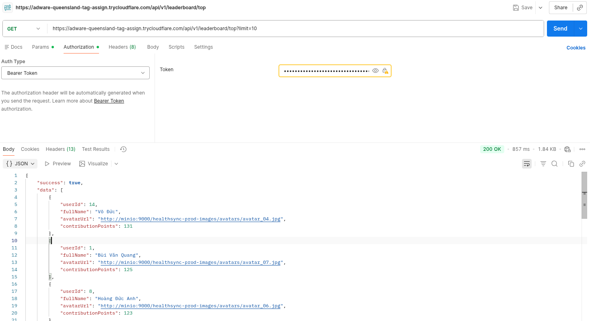 <br> *Truy vấn nhanh danh sách Top 10 thành viên tích cực* | 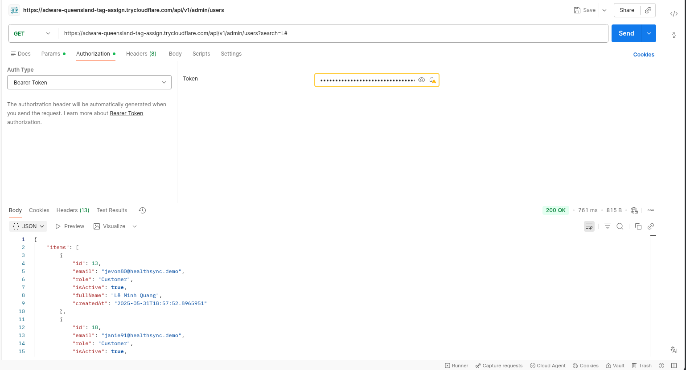 <br> *Admin tra cứu và phân loại tài khoản người dùng* | 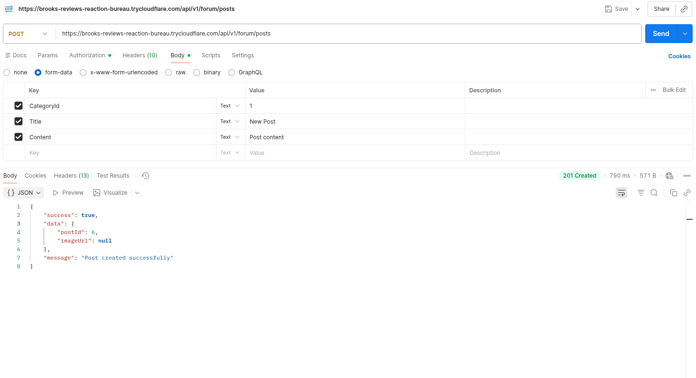 <br> *Tạo thảo luận mới thành công trả về mã 201 Created* |

---

## 4. Tái tạo môi trường & Triển khai hệ thống (Reproducibility & DevOps)

Nhóm em thiết lập quy trình triển khai vô cùng đơn giản bằng Docker, giúp mọi người có thể dựng lại môi trường và chạy thử hệ thống ngay trên máy local một cách nhanh chóng.

### 4.1. Chuẩn bị môi trường & Biến môi trường
1. Sao chép các file môi trường mẫu thành file cấu hình thực tế:
   - Copy `.env.example` sang `.env` (chứa cấu hình chung)
   - Copy `.env.dev.example` sang `.env.dev` (cấu hình cho môi trường phát triển Docker)
2. Mở file `.env.dev` lên và cấu hình lại các thông số cần thiết (mật khẩu SA Database, khóa bảo mật JWT, thông tin kết nối OAuth2 Google,...).

### 4.2. Khởi chạy bằng Docker Compose
Nhóm em đã viết sẵn kịch bản Docker Compose tự động hóa toàn bộ việc tải ảnh Docker, cấu hình mạng và kết nối các container.
Bạn chỉ cần mở Terminal tại thư mục gốc của dự án và gõ lệnh:

```bash
# Khởi chạy toàn bộ hệ thống ở chế độ chạy ngầm (Detached mode)
docker compose up -d
```

Hoặc nếu bạn muốn chạy ở môi trường phát triển có tích hợp công cụ tự động reload code khi sửa file (`dotnet watch`):

```bash
docker compose -f docker-compose.dev.yml up --build -d
```

Sau khi chạy lệnh, Docker sẽ tự động dựng lên:
* **Database (SQL Server):** Port `1434` (external)
* **MinIO Object Storage:** API chạy ở port `9000`, Console UI để bạn quản lý file chạy ở port `9001` (user/pass mặc định: `minioadmin` / `minioadmin`)
* **Web API Service:** Port `8080` (sử dụng NGINX làm cổng tiếp nhận port `80` chuyển tiếp)
* **Database Migration Service:** Tự động chạy các bản migration cập nhật bảng và seed dữ liệu mẫu bài tập/món ăn lên Database & ảnh lên MinIO rồi tự động tắt khi hoàn thành.

Bạn có thể kiểm tra sức khỏe của API tại đường dẫn: `http://localhost/health` hoặc truy cập tài liệu Swagger API tại: `http://localhost/swagger` (nếu chạy ở môi trường Development).

---

### 4.3. Quy trình CI/CD tự động hóa với Jenkins & SonarQube
Nhóm em áp dụng triệt để tư duy DevOps vào quy trình làm việc của nhóm:

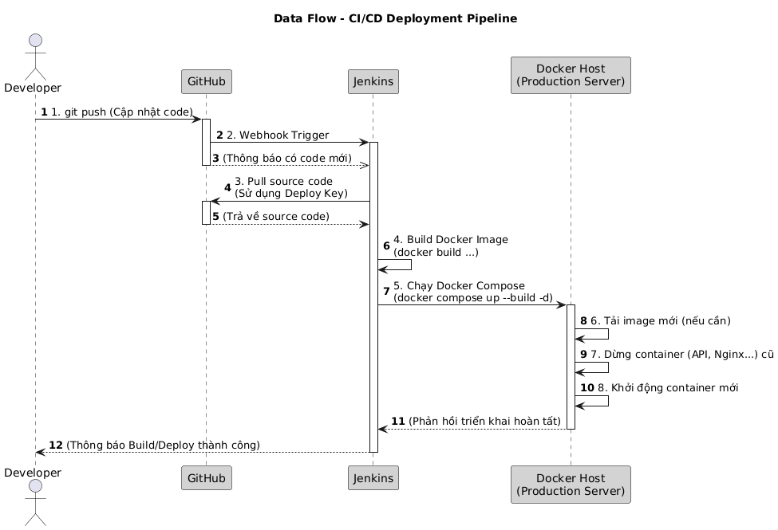

1. Mỗi khi thành viên trong nhóm code xong và thực hiện `git push` lên nhánh chính trên **GitHub**.
2. **GitHub Webhook** sẽ gửi tín hiệu kích hoạt (trigger) đến server **Jenkins** chạy trong mạng nội bộ của nhóm em.
3. Để Jenkins có thể nhận Webhook từ GitHub mà không cần địa chỉ IP tĩnh công cộng, nhóm em đã thiết lập **Cloudflare Tunnel (Cloudflared Container)** làm đường hầm bảo mật ánh xạ cổng Jenkins ra ngoài internet.
4. **Jenkins Pipeline** (định nghĩa trong [Jenkinsfile](Jenkinsfile)) tự động thực thi các bước:
   - **Checkout:** Kéo mã nguồn mới nhất về.
   - **Build & Test:** Chạy restore và thực hiện chạy các Unit Tests đo code coverage.
     
     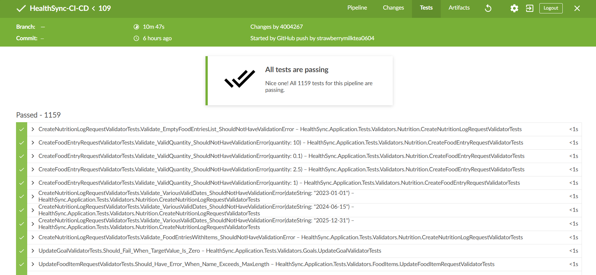
     *Kết quả chạy tự động 1159 bài test thành công và báo cáo độ bao phủ*
     
   - **Static Analysis:** Đẩy mã nguồn lên **SonarQube** container để quét chất lượng code, kiểm tra lỗ hổng bảo mật và code smells.
     
     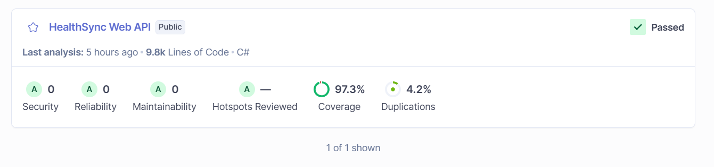
     *Dashboard SonarQube báo cáo dự án PASSED tất cả các tiêu chí Quality Gate*
     
   - **Deploy:** Tự động build Docker Image mới, dừng container API cũ và khởi chạy container API mới bằng mã nguồn vừa cập nhật.

     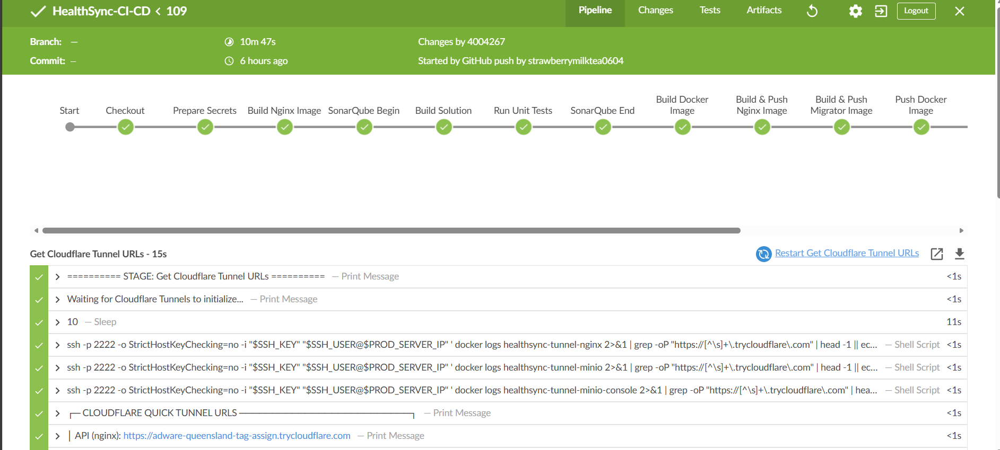
     *Giao diện Jenkins Pipeline trực quan hóa các bước tự động và luồng build*

---

## 5. Cấu trúc thư mục dự án (Directory Structure)

Mã nguồn được tổ chức ngăn nắp, khoa học giúp người đọc dễ tiếp cận và phát triển tiếp:

```text
HealthSyncWebAPI/
├── docs/                               # Chứa tài liệu đồ án của nhóm
│   ├── images/                         # Chứa các sơ đồ, hình ảnh trích xuất từ báo cáo
│   ├── Testcase Server Nâng cao...     # Chứa 87 ảnh chụp màn hình kiểm thử & file Excel Test Cases
│   │   ├── testcase server nâng cao.xlsx
│   │   └── ...                         # Các ảnh chụp kết quả kiểm thử (TC-AUTH-001.png,...)
│   ├── Báo Cáo Đồ Án Server Nâng Cao...pdf # File báo cáo đồ án chi tiết (36 trang)
│   └── Checklist Server Nâng cao...xlsx # File tiến độ chạy Sprints
│
├── HealthSync.Domain/                  # Tầng Domain: Entities, Enums cốt lõi
├── HealthSync.Application/             # Tầng Application: Services, DTOs, Validators, Interfaces
├── HealthSync.Infrastructure/          # Tầng Infrastructure: EF Core, Repositories, Jwt, Minio, Workers
├── HealthSync.WebApi/                  # Tầng WebApi (Presentation): Controllers, Middlewares, SeedData
│
├── nginx/                              # Thư mục cấu hình cho Reverse Proxy Nginx
│   └── nginx.conf
├── Jenkinsfile                         # Định nghĩa các bước build, test, deploy tự động của Jenkins
├── Dockerfile                          # Dockerfile build và chạy ứng dụng chính Web API (.NET 8.0)
├── Dockerfile.migration                # Dockerfile chạy migrate database và seed data lúc khởi động
├── Dockerfile.nginx                    # Dockerfile đóng gói Nginx proxy
├── docker-compose.yml                  # Cấu hình container chạy chính thức (Production)
├── docker-compose.dev.yml              # Cấu hình container chạy phát triển (Development)
├── .env.example                        # File cấu hình biến môi trường mẫu chung
├── .env.dev.example                    # File cấu hình biến môi trường mẫu cho Dev
└── HealthSyncWebAPI.sln                # File Solution quản lý dự án trong Visual Studio
```

---

## 6. Công nghệ sử dụng & Lời cảm ơn (Acknowledgments)

### 6.1. Chi tiết Tech Stack
* **Lập trình chính:** C# / .NET 8.0 (ASP.NET Core Web API)
* **Kiến trúc phần mềm:** Clean Architecture, Repository Pattern, CQRS-like Services
* **Cơ sở dữ liệu:** Microsoft SQL Server 2022, Entity Framework Core (EF Core)
* **Xử lý tác vụ ngầm:** Hangfire (Background Workers)
* **Lưu trữ tệp tin:** MinIO S3-Compatible Object Storage
* **Bảo mật:** JWT (JSON Web Token), Refresh Token Rotation, RBAC Middleware
* **Kiểm thử:** xUnit, FluentAssertions, Moq, OpenCover, ReportGenerator
* **Hạ tầng & DevOps:** Docker, Docker Compose, Nginx, Jenkins CI/CD, Cloudflare Tunnel, SonarQube

---

### 6.2. Danh sách thành viên thực hiện & Phân công nhiệm vụ (Nhóm 4)

Đồ án được hoàn thiện dựa trên kịch bản phân công chạy Sprint được quy định chặt chẽ trong file Excel **Checklist Server Nâng cao - Nhóm 4 .xlsx**:

| STT | Họ và tên | Mã sinh viên / Lớp | Vai trò | Phân công nhiệm vụ thực tế theo Checklist |
|:---:|:---|:---:|:---:|:---|
| 1 | **Lã Minh Khánh** | 4004267 <br> (67CS) | **Nhóm trưởng** | - **System Design:** Sơ đồ phân rã chức năng, luồng dữ liệu (pipeline), sơ đồ tuần tự & hoạt động, sơ đồ thiết kế bảo mật (JWT, RBAC). <br>- **Backend Core:** Khởi tạo cấu trúc solution Clean Architecture, cài NuGet, cấu hình DbContext. Triển khai đăng ký/đăng nhập JWT, DTOs (`RegisterRequest`, `LoginRequest`). Tích hợp Google OAuth2 phía Server. <br>- **DevOps & Infrastructure:** Dockerize ứng dụng, cấu hình file `docker-compose.yml` (scale 2 API replicas). Thiết lập container Jenkins, Git Webhook, credentials, Deploy Key. Cấu hình Ngrok để publish API. Điều phối công việc nhóm trên Jira. |
| 2 | **Nguyễn Hải Cường** | 0174067 <br> (67CS) | **Thành viên** | - **System Design:** Vẽ biểu đồ Use-case (Customer) và Class Diagram tổng quan. <br>- **Backend Development:** Đồng phát triển `AuthService` (logic hash password, sinh JWT) và cấu hình JWT Middleware. Triển khai API Admin tra cứu người dùng (`GET /api/admin/users` có phân trang) và khóa/mở tài khoản. API upload ảnh đại diện (`POST /api/profile/avatar`). <br>- **DevOps & Infrastructure:** Tích hợp MinIO SDK (`MinioService`, `IStorageService`). Cấu hình NGINX Load Balancing (viết file `nginx.conf`). Cài đặt Jenkins Job CI/CD, viết script build/deploy trong `Jenkinsfile`. Tách môi trường `.env.dev` / `.env.prod`. <br>- **Testing:** Thực hiện kiểm thử chéo phân hệ Forum. |
| 3 | **Trịnh Quỳnh Anh** | 0279367 <br> (67CS) | **Thành viên** | - **System Design:** Sơ đồ thực thể ERD, Sơ đồ tuần tự đăng bài & Sơ đồ kiến trúc tổng quan. <br>- **Backend Development:** Định nghĩa các Entities (`CommunityChallenge`, `UserChallengeSubmission`, `Goal`, `ProgressRecord`, `ExerciseSession`,...). Đồng phát triển các API Admin (`Admin/ExerciseController`, `Admin/FoodController`, `Admin/ForumCategoriesController`). Triển khai API lấy lịch sử dinh dưỡng của Customer, tích hợp logic tự động tính Calo/Macros khi ghi nhật ký ăn uống. <br>- **Admin & Moderation:** Phát triển `ForumModerationController`, API ghim/khóa bài viết. API duyệt thử thách (`/api/admin/challenges/approve/{submissionId}`). <br>- **Background Jobs:** Cấu hình Hangfire Worker, viết logic tính điểm tích lũy (1 Log = 5 điểm, 1 Post = 2 điểm, 1 Reply = 1 điểm). |
| 4 | **Phạm Hồng Thái** | 0127067 <br> (67CS) | **Thành viên** | - **Backend Development:** Phát triển API CRUD cho Thư viện Bài tập (Exercise) và Thư viện Dinh dưỡng (FoodItem). Phát triển API CRUD Chuyên mục Diễn đàn (ForumCategory). Triển khai API ghi nhật ký dinh dưỡng cho người dùng (`POST /api/nutrition-logs`). <br>- **Admin & Dashboard:** Thiết lập controller `Admin/CommunityChallengeController`, viết API từ chối thử thách (`/api/admin/challenges/reject/{submissionId}`). Phát triển API Dashboard Admin lấy 3 chỉ số chính và Top 5 bài tập/chủ đề hot. API gán danh hiệu cho người dùng tích cực. <br>- **Testing:** Viết testcases kiểm thử chéo phân hệ Auth & Leaderboard. |
| 5 | **Hoàng Quốc Vinh** | 0312867 <br> (67CS) | **Thành viên** | - **System Design:** Vẽ sơ đồ Use-case (Admin). <br>- **Customer Profile & Goals:** API cập nhật chỉ số sinh trắc học (`PUT /api/profile/me`), lấy danh sách mục tiêu cá nhân (`GET /api/goals`). <br>- **Workout & Progress:** API lấy lịch sử tập luyện (`GET /api/workout-logs`). API nhập cân nặng/số đo mới (`POST /api/progress-records`) và API lấy dữ liệu vẽ biểu đồ tiến trình (`GET /api/progress-records/chart`). <br>- **Community & Social:** API đăng bài viết diễn đàn (giao tiếp MinIO upload ảnh), sửa bài viết, lấy chuyên mục diễn đàn, lấy chi tiết bài đăng và replies. API lấy Top 10 Bảng xếp hạng sắp xếp theo ContributionPoints. API tham gia thử thách (`POST /api/challenges/{id}/join`) và nộp kết quả thử thách. |
| 6 | **Phạm Hoàng Phong** | 0218066 <br> (66CS) | **Thành viên** | - **UserProfile & Goals:** API lấy hồ sơ cá nhân (`GET /api/profile/me`), tạo mục tiêu mới (`POST /api/goals`) kèm các DTOs tương ứng. <br>- **Workout Log:** API ghi nhật ký buổi tập (`POST /api/workout-logs`) và viết service xử lý nghiệp vụ lưu WorkoutLog cùng các ExerciseSession con. <br>- **Forum & Challenges:** API bình luận bài viết (`POST /api/forum/replies`), xóa bài đăng. API lấy danh sách thử thách đang mở và API nộp bài thử thách (`POST /api/challenges/submit/{submissionId}` có upload ảnh). <br>- **Documentation & Support:** Đồng thiết lập `LeaderboardController`, rà soát Swagger API documentation (thêm xml comments, mô tả endpoints). Kiểm thử chéo hệ thống và chuẩn bị demo kịch bản 2 & 3. |

---

### 6.3. Lời cảm ơn chân thành
Chúng em xin gửi lời cảm ơn sâu sắc nhất tới **Thầy Ths. Lê Văn Minh** - giảng viên hướng dẫn môn học *Phát triển hệ thống phía server nâng cao*. Trong suốt học kỳ vừa qua, thầy đã dành nhiều thời gian, tâm huyết để định hướng tư duy thiết kế hệ thống, chỉ dạy cho chúng em những tiêu chuẩn công nghệ thực tế đang được áp dụng tại các doanh nghiệp lớn. Những phản hồi chỉnh sửa tỉ mỉ của thầy về cơ chế bảo mật Token Rotation, cách chia tách Clean Architecture và quy trình triển khai CI/CD đã giúp đồ án của chúng em hoàn thiện hơn rất nhiều.

Đồng thời, nhóm cũng xin cảm ơn các thầy cô khoa CNTT trường Đại học Xây dựng Hà Nội đã truyền dạy những kiến thức nền tảng bổ ích, cảm ơn bạn bè cùng các anh chị khóa trên đã luôn chia sẻ tài liệu và động viên nhóm hoàn thành tốt đồ án này. Dù đã rất nỗ lực thiết lập quy trình kiểm thử nghiêm ngặt, đồ án chắc chắn vẫn không tránh khỏi những thiếu sót. Chúng em rất mong nhận được những nhận xét, đóng góp quý báu từ thầy cô để hệ thống được hoàn thiện hơn nữa!

***Tập thể Nhóm 4 xin kính chúc Thầy Lê Văn Minh luôn mạnh khỏe, hạnh phúc và thành công trên sự nghiệp trồng người!***
